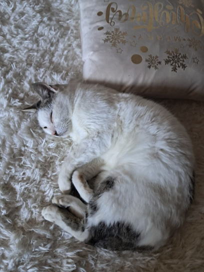

## Meet my Cat

My cat's name is Freud! He is a 6-year-old happy kitty.

::: {style="text-align: center;"}
{height="500px"}
:::

## My cat's schedule {.smaller}

The following table (Table 1) summarizes how my cat typically spends his time during a single day (measured in hours) and how much he enjoys each activity on a Likert scale from 1-10 (1: Hate this activity - 10: Love this activity). Ratings were made by the owner (author) based on his subjective observations of the cat's behavior.

::: {style="text-align: center;"}
<strong>**Table 1**</strong><br> <em>*My cat's favourite activities* </em>
:::

```{r}
library(DT)

cat_data <- data.frame(
  Activity = c("sleeping", "eating/chewing", "playing"),
  Hours_per_day = c(18, 2, 4),
  Liking=c(10,9,8)
)

datatable(
  cat_data,
    options = list(
    paging = FALSE,
    searching = FALSE,
    info =FALSE
  )
)
```

## Freud in Action

This is the day Freud came into our lives (April 2020).



## Freud's Food Preferences

::::: columns
::: {.column width="50%"}
### Favourite Foods

- Fish
- Chicken
- Dry food
- Pork
- Beef
- Mice
- Cicadas
- Milk
:::

::: {.column width="50%"}
### Least Favourite Foods

I do not think Freud has any foods he dislikes (he eats everything!)
:::
:::::

## Freud's Amount of Time Sleeping {.smaller}

Let's assume that $T_{\text{total}}$ represents the total number of hours in one day (24 hours), and $T_{\text{sleep}}$ represents the total number of hours Freud spends sleeping within a single day (18 hours). Then to calculate the proportion of time Freud spends sleeping, $P_{\text{sleep}}$, we have to divide the hours he sleeps by the total hours in a day. The proportion can be calculated as follows:

$$
\begin{aligned} 
P_{\text{sleep}} &= \frac{T_{\text{sleep}}}{T_{\text{total}}} \\
&= \frac{18}{24} \\
&= 0.75.
\end{aligned}
$$

## Can people identify what's in a cat's meow?

A recent study examined 225 adult participants' ability to associate a cat's meowing with the context that it occurred. Less than half of the sample was successful at it, indicating that, despite cats' efforts of communication, we are not that good at listening to them [@pratoprevide2020].

## Code displayed but not executed

```{r}
#| eval: false #Not executed code
#| echo: true #Code displayed
freud_characteristics<-c("cute","paws","kitty","white","furry","handsome")
print(freud_characteristics) #the characteristics of Freud are not printed
```

## Cached and labeled R code, executed but not displayed {.smaller}

The following figure demonstrates the amount of time Freud spends sleeping vs being awake during a single day.

::: {style="text-align: center;"}
<strong>**Figure 1**</strong><br> <em>*Freud's time sleeping vs being awake*</em>
:::

```{r}
#| label: sleep_time
#| cache: true
#| echo: false
#| fig-align: center

sleep_data <- data.frame(
  Category = c("Sleeping", "Awake"),
  Hours = c(18, 6)
)

barplot(
  sleep_data$Hours,
  names.arg = sleep_data$Category
)
```

## Environment Characteristics

We create a renv.lock file which records the package versions used so someone else can recreate the same R environment.

```{r}
#| echo: true
library(renv)
renv::init()
```

## Disclaimer

ChatGPT has been used to refine and produce code in certain parts of the assignment, as well as to make Grammar edits. All AI-assisted content was reviewed by the author.

## References

::: {#refs}
:::
